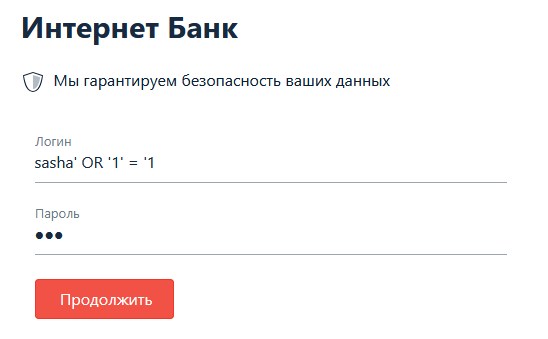
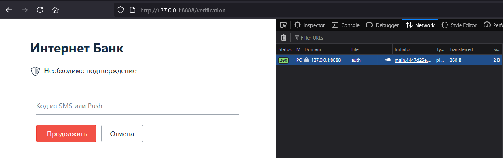

# Домашнее задание к занятию «1.3. SQL и транзакции»- Михалёв Сергей

## Описание

Описание задания.

Разработчики подготовили прототип будущей системы интернет-банка.

Для запуска нужно скачать файлы из каталога `assets`:
* [`docker-compose.yml`](./assets/docker-compose.yml);
* [`docker-entrypoint-initdb.d/init.sql`](./assets/docker-entrypoint-initdb.d/init.sql).

После скачивания структура на вашем диске должна иметь вид:
* файл `docker-compose.yml`;
* каталог `docker-entrypoint-initdb.d`;
    * файл `init.sql`.
    
Для запуска используйте команду `docker-compose up`.

Для остановки и удаления контейнеров используйте `docker-compose down`.

## Задание «Логин и пароль»

### Этапы выполнения

Фронтенд сервиса работает на порту 8888:

Используя ваши знания об SQL Injection, подберите входные данные так, чтобы попасть на следующий экран с подтверждением кода без знания пароля, при этом вы при помощи методов социальной инженерии узнали, что в системе существует пользователь с логином `sasha`.

Примечание*. Конечно, вы можете подсмотреть хеш пароля в БД, но пароль ещё придётся подобрать.

Подсказка

Контейнер PostgreSQL настроен так, что логирует все SQL-запросы, присылаемые сервером. Воспользуйтесь этим.

### Результаты выполнения задания

В качестве результата пришлите входные данные, которые позволяют пройти на следующий экран без знания пароля пользователя.

